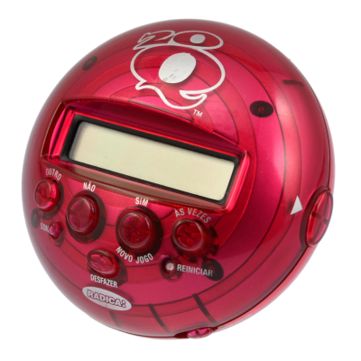

# 20 Questions Game Editor

This application is a *20Q* style game builder.
This application can be used to build custom games of 20 questions. You can add items, and answer yes
and no questions about them to place them on a binary tree. After, another player can think of an item, answer
the questions, and the program will guess what it is!

### User Stories

* As a user, I want to be able to create a guessable item and have it automatically added to the current question node.
* As a user, I want to be able to view an item in a node and sort it by yes/no, automatically creating child nodes when
possible.
* As a user, I want to be able to set a question for my current node.
* As a user, I want to be able to be able to navigate through the question tree.
* As a user, I want to be able to optionally set descriptions for items.
* As a user, I want to be able to save my question tree, including all sorted and unsorted items.
* As a user, I want to be able to load a question tree from file and continue editing.
* As a user, I want to be able to play a game where I can think of an item, answer yes/no question, and have my item
guessed for me.
